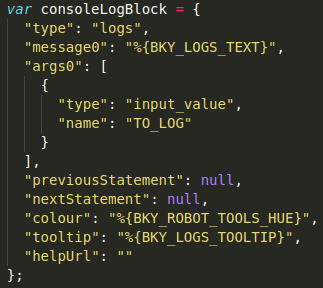
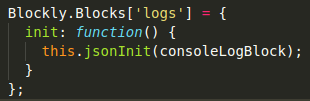
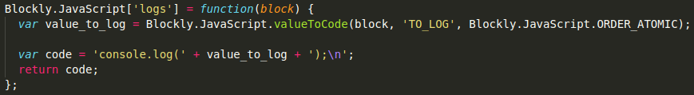
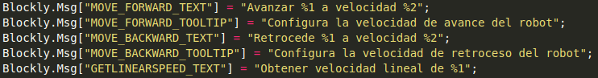

# WebSim repository

Web robot simulator using A-Frame technologies.

The project directory structure contains:

## Index

1. [Project structure](#structure)
    - [Simcore](#simcore)
    - [Assets](#assets)
    - [JavaScript](#js)
    - [Scratch](#scratch)
    - [Teleoperation](#teleop)
2. [Getting started](#get_started)
    - [Prerequisites](#prerequisites)
      - [NodeJS in Ubuntu](#node_ubuntu)
    - [Installing project for development](#develop)
    - [Running project](#run)
    - [Webpack usage](#webpack)
3. [Integration with Official Production Server](#integration_server)
    - [Generate Bundles](#gen_bundles)
    - [Copy Bundles' scripts](#copy_bundles)
4. [HAL API](#hal_api)
    - [Motors interfaces](#motors)
    - [Camera interfaces](#camera)
    - [Position sensors](#sensors)
5. [SIM API](#sim_api)
6. [Scratch Blocks](#scratch_blocks)
    - [How to create Scratch Blocks](#create_blocks)
    - [Constructor Blocks](#constructorBlockly)
    - [Motors Blocks](#motorsBlockly)
    - [Camera Blocks](#cameraBlockly)
    - [Tools Blocks](#toolsBlockly)
    - [Sensors Blocks](#sensorsBlockly)
7. [Teleoperation](#tp)
8. [Youtube videos](#yt)

## Project structure <a name="structure"></a>

This section is intended to explain folder structure and content for the project. As an overview the software is divided in app folders, simulator core and resources used in both web apps and simulator core.

### Simcore <a name="simcore"></a>
The AFrame core of the simulator, it includes Aframe components, JS programming interfaces for the supported robots (their HAL-API, Hardware Abstraction Layer).

### Assets <a name="assets"></a>
World files, configuration files, images...

### JavaScript <a name="js"></a>
A webpage for programming of WebSim robots locally in JS, using the ACE editor and a local node or python webserver.

Under the directory all ACE Editor config files are included.

### Scratch <a name="scratch"></a>
A webpage for programming of WebSim robots locally in Scratch using the blockly editor and a local node or python webserver. In addition it hosts the use of WebSim from the Django webserver of KiBotics. It also includes the Scratch2JS converstion (using blocky) and the Scratch2Python conversion (using blocky).

Under the directory all Scratch config files and custom block files are included.

### Teleoperation <a name="teleop"></a>
Several webpages to graphically teleoperate the supported robots and see their instantaneous sensor values. One for PiBot, one for Tello drone and one for F1 car.


## Getting Started <a name="get_started"></a>

These instructions will get you a copy of the project up and running on your local machine for development and testing purposes.

### Prerequisites <a name="prerequisites"></a>

This project needs the following installations.

- [NodeJS](https://nodejs.org/es/download/) >= 6.11.5
- NPM
- Web browser, [Firefox](https://www.mozilla.org/es-ES/firefox/new/) recommended.

#### NodeJS on Ubuntu <a name="node_ubuntu"></a>

The following instructions works on Ubuntu 16.04 and 18.04.

- **Step 1**: Add PPA repositories, two options possible, use **current** release of NodeJS or use the **LTS** release (recommended) of NodeJS.

``` bash
## Current version
sudo apt-get install curl software-properties-common
curl -sL https://deb.nodesource.com/setup_13.x | sudo -E bash -
```

``` bash
## LTS version
sudo apt-get install curl software-properties-common
curl -sL https://deb.nodesource.com/setup_12.x | sudo -E bash -
```

- **Step 2**: Once added NodeJS to repositories, install via `apt-get`.

``` bash
sudo apt-get install nodejs
```

- **Step 3**: Check NodeJS installation. The following commands will show installed version of NodeJS and NPM.

``` bash
node -v
```
output: v12.13.1 (minimum v12.x.x)

``` bash
npm -v
```
output: 6.12.1 (minimum 6.x.x)

**NOTE**: Installation of *LTS Version* is recommended.

### Installing project for development <a name="develop"></a>

First clone this repository on your local machine with the following command:

``` git
git clone https://github.com/jderobot-hub/kibotics-websim
```

Once copied to your local machine in terminal run:

``` bash
cd kibotics-websim/simcore
```

At this point run the following command to install all dependencies for development:

``` npm
npm install
```

If the above command fails, check that you have `nodejs` and `node-gyp` installed. To install it type:

```bash
sudo apt-get install nodejs-dev node-gyp libssl1.0-dev
sudo apt-get install npm
```

This will create `package-lock.json` file and `node_modules` on the parent directory (i.e. _kibotics-websim/package-lock.json_ and _kibotics-websim/node_modules/_). If there are no errors in the installation all dependencies are ready for local development.


### Running project <a name="run"></a>

To test the application run:


```
npm run start
```


Then, your browser  will be open. Three application exists `JavaScript`, `Scratch` and `teleoperators` applications with the following URLs [`http://localhost:8080/JavaScript`](), [`http://localhost:8080/Scratch`]() and [`http://localhost:8080/teleoperators`]().

Now, every change in js files generates rebuild and reload orders in server, you don't need do nothing.  


### Webpack usage <a name="webpack"></a>

This project is packaged using webpack, this tool allows to create bundled package with all application dependencies. The bundles are located under `/JavaScript/build` and `/Scratch/build` folders and referenced from `index.html` for each application.

Webpack is configured on this project with different modes with 2 different commands:

- `npm run dev` : This command creates a development bundle called `websim.bundle.js`. In addition Webpack is listening every change on code and creates new bundles on every new code save. This allows developers to run server on other Terminal and see changes directly on web browser.
- `npm run build` : This command creates a production bundle, this bundle is minified and optimized for production environments. **Note**: Use this command when the new features/changes are stable.

## Integration with Official Production Server <a name="integration_server"></a>

In order to integrate Websim simulator with the production sevrer (Kibotics), there are two steps to follow:
1. Generate the bundles through webpack 
2. Copy the generated files in the server

**WARNING**: DO NOT upload the bundle files, neither the `/build` directories, to this repository, so potential problems with broken bundle files are not propagated and are therefore avoided.

### Generate Bundles <a name="gen_bundles"></a>

The bundles for the production environment need to be generated within an **Ubuntu 18.04** distribution. Thus, once the new features/changes added or made to Websim JavaScript files are stable, it is just needed to run:
```
$ npm run build
```
**NOTE**: Ensure to run the previous instruction in Ubuntu 18.04.
As said before, this command creates a production bundle, which is minified and optimized for production environments.

### Copy Bundles' scripts <a name="copy_bundles"></a>

Once the bundles are built, we need to place them in their correspondig directory of the web-server. This bundle files must be placed in `/var/www/kibotics/jderobot_server/kibotics-websim/Scratch-editor/build`, `/var/www/kibotics/jderobot_server/kibotics-websim/JavaScript-editor/build` and `/var/www/kibotics/jderobot_server/kibotics-websim/teleoperators/build`.

**Note**: Pay special attention to the placement of the first, given that *Scratch-editor* is the one that is currently used in kibotics.

The instructions needed are the following:
```
$ sudo cp editor.bundle.js /var/www/kibotics/jderobot_server/kibotics-websim/[EDITOR]/build
$ sudo cp websim.bundle.js /var/www/kibotics/jderobot_server/kibotics-websim/[EDITOR]/build
```
After that, refresh the collection of statics files of the server:
```
$ cd /var/www/kibotics/jderobot_server
$ python manage.py collectstatic
```

## HAL API (*Hardware Abstraction Layer*) <a name="hal_api"></a>

This section explains the methods for the robot interface, commonly called HAL API. This methods allows robot to execute instructions like move forward, turn, etc.

The robot has mirror methods translated to spanish language too.

### Motor interfaces <a name="motors"></a>

Under this subsection are summarized and explained the motors methods, this methods allows robot to move.

| Method | Description | Argument Description | Type | Example |
| :----: | :---------: | :------------------: | :--: | :-----: |
| setV(linearSpeed) | Sets linear speed for the robot. | linearSpeed: Linear speed for the body. | Float | myRobotInstance.setV(0.4) |
| setW(angularSpeed) | Sets angular speed for the robot. | angularSpeed: Angular speed for the body. | Float | myRobotInstance.setW(0.4) |
| setL(elevationSpeed) | Sets elevation speed for drone robots. | elevationSpeed: Lateral speed. | Float | myRobotInstance.setL(0.7) |
| move(linearSpeed, angularSpeed, elevationSpeed) | Sets linear and angular speed for the robot. | linearSpeed: Linear speed. / angularSpeed: Angular speed / elevationSpeed: Elevation speed | Float , Float , Float| myRobotInstance.move(0.7, 0.5, 0.3) |
| getV() | Returns linear speed given or 0 | - | - | myRobotInstance.getV() |
| getW() | Returns angular speed given or 0 | - | - | myRobotInstance.getW() |
| getL() | Returns elevation speed given or 0 | - | - | myRobotInstance.getL() |
| getRotation() | Returns object with the rotation on X, Y, Z axis | - | - | myRobotInstance.getRotation() |

**Spanish API**

| Method | Description | Argument Description | Type | Example |
| :----: | :---------: | :------------------: | :--: | :-----: |
| avanzar(linearSpeed) | Sets linear speed for the robot. | linearSpeed: Linear speed for the body. | Float | myRobotInstance.avanzar(0.4) |
| retroceder(linearSpeed) | Sets linear speed for the robot to move back. | linearSpeed: Linear speed for the body. | Float | myRobotInstance.retroceder(0.4) |
| girarIzquierda(angularSpeed) | Sets angular speed for the robot to turn left. | angularSpeed: Angular speed for the body. | Float | myRobotInstance.setW(0.4) |
| girarDerecha(angularSpeed) | Sets angular speed for the robot to move right. | angularSpeed: Angular speed for the body. | Float | myRobotInstance.setW(0.4) |
| aterrizar() | Function used by drone robots to land on the ground | - | - | myRobotInstance.aterrizar() |
| despegar(angularSpeed) | Function used by drone robots to fly. | - | - | myRobotInstance.despegar() |
| parar(angularSpeed) | Stops the robot setting all speeds to 0 | - | - | myRobotInstance.parar() |


### Camera interfaces <a name="camera"></a>


This subsection explains all methods that involves camera usage.

| Method | Description | Argument Description | Type | Example |
| :----: | :---------: | :------------------: | :--: | :-----: |
| startCamera() | This method is not callable, is a task to run the getImage_async after canvas is loaded | - | - | Not in use |
| getImage_async() | This method is not callable, is a continious task to get the image from the WebGL canvas | - | - | Not in use |
| getImage() | Returns a cv.Mat() object with the data from the WebGL canvas with id "camera2" | - | - | myRobotInstance.getImage() |
| getObjectColor(color) | Returns an object with center coordinates of an object detected with color passed as argument. | color: color of the object to detect, given colors ( red, blue, green ) | string | myRobotInstance.getObjectColor("blue") |
| getObjectColorRGB(arrayLowVal, arrayHighVal) | Returns same as getObjectColor but now it takes 2 arrays of values (RGBA) to avoid different color filters | array , array  | myRobotInstance.getObjectColor([230,0,0,0], [255,0,0,255]) |
| getColorCode(color) | Returns a matrix with RGB low and high filter for an specified color, not callable. | color: color to search on predefined understandedColors object | string | Not in use |
| followLine(lineColor, speed) | Executes a predefined follow line algorithm | colorLine: color for the line to follow / speed: linear speed for the robot | string / number | myRobotInstance.followLine("white", 0.4) |
| readIR(reqColor) | Crops robot image, filters and calculates center of object with color passed as argument. Returns 0-1-2-3 depending of center position | reqColor: color for the object to filter on image | string | myRobotInstance.readIR("white") |


### Position sensors <a name="sensors"></a>

| Method | Description | Argument Description | Type | Example |
| :----: | :---------: | :------------------: | :--: | :-----: |
| startRaycasters(distance, numOfRaycasters) | This method sets up a given number of raycaster which far property is given by distance | distance: Distance for every raycaster (meters) / numOfRaycasters: Number of raycasters to check intersections. | Float , Float | Not in use, rays starts on robot load |
| setListener() | This method is not callable, sets a listener for the event 'intersection-detected-id' and 'intersection-cleared-id' and gets distance emitted by event or null, every single raycaster has its own custom event. | - | - | Not in use |
| getDistance() | This method returns the distance (float) between robot and the raycaster intersection in the center. | - | - | myRobotInstance.getDistance() |
| getDistances() | This method returns the distance (float) between robot and each raycaster intersection. | - | - | myRobotInstance.getDistances() |
| stopRaycasters() | This method erases all raycaster properties, disables sensor | - | - | myRobotInstance.stopRaycasters() |
| createRaycaster( distance, angle, emptyEntity, group, number) | This method creates a single raycaster. Not callable. | distance, angle, group and number are raycaster properties, emptyEntity is the entity where raycaster will be appended. | Float, Float, String, Integer, HTML object | Not in use |
| setListener() | This method creates event listener for every raycaster. Not callable. | - | - | Not in use |
| updateDistance() | This method update distances catched by raycasters. Not callable. | - | - | Not in use |
| eraseDistance() | This method erases distance entry when 'intersection-cleared' event fires up for a raycaster. Not callable. | - | - | Not in use |
| removeListeners() | This method removes event listener for all raycasters. Not callable. | - | - | Not in use. |
| getPosition() | This method returns the position of the robot and rotation on Y axis as JS object. | - | - | myRobotInstance.getPosition() |


## SIM API (*Simulation API*) <a name="sim_api"></a>

This section explains the functionality of thw simulation API implemented in WebSim simulator. SIM API methods are encapsulated inside `websim-world-controller.js` and are used to control the execution of code in the robot.

- **startStopCode**: This function is used to start or stop the code that robot is running.
- **cleanRedefinition**: This function is used to remove `myRobot` and `mainInterval` calls from the code that robot will run.


## Scratch Blocks <a name="scratch_blocks"></a>

In this section references only to Scratch application, here the custom blockly blocks usage is explained.

The new blocks are allocated on blockly editor under RobotAPI category, this category is subdivided in four new
categories, [Motors](#motorsBlockly), [Sensors](#sensorsBlockly), [Tools](#toolsBlockly) and [Camera](#cameraBlockly).

### How to create Scratch block <a name="create_blocks"></a>

This subsection is an overview of how to create and adapt Scratch Blocks to WebSim simulator, for a full documentation on Scratch go to [Google Blockly](https://developers.google.com/blockly/) documentation.

Custom Scratch blocks are needed to implement blocks that interacts with robot **HAL API**. This blocks could be implemented in two ways as JSON or as JavaScript, due to simplicity we recommend to use JSON.

This JSON has the following fields:



Where:
- __type__: References to the name given to the block used to configure. This name is used when declaring toolbar on the web browser and when declaring function to init block and translate block to code.
- __message0__: Text printed when the block is rendered, the field value uses an internal variable of blockly that will be explained later.
- __args0__: Array of arguments that blockly will use, on this case we use an _input_value_ that could be a text block, number, etc.
- __previousStatement__: This field is used to permit block to connect after a previous block. This block will be connected just under the previous block.
- __nextStatement__: This field permits to connect following blocks under the current block.
- __colour__: Sets the colour HUE value for the current block. The colour could be defined as an integer or could be defined as Blockly variable as shown in the previous image.
- __tooltip__: Message that will be shown when you move the mouse over the block. Could be defined directly as text or defined through blockly variables, this feature is useful to reuse the same block on different languages.
- __helpUrl__: Url that shows extended information for the block. (Unused)

The blocks need to be created when Blockly starts, to start the block we need to create the function that inits the block like the example below.



This function just calls the method `this.jsonInit` of the object Blockly that initiates the block through the JSON object previously explained.

Finally code generators are needed, this generators are used to convert block to code. Some differents languages are supported but here we will focus on JavaScript language. The function to translates the code looks like:



The variables `value_to_log` contains the input content for the block and the variable `code` contains as string the full code translate to JavaScript.

As shown before a number of blockly variables are used and previously defined, this variables permits to declare tooltip texts in different languages, color used for blocks of a certain category or the text rendered inside the block in different languages.

This variables are declared inside the [msg](./Scratch/google-blockly/msg/js) folder. Here we can see a collection of `.js` files with names pointing to corresponding language in __alpha-2__ code. We used __Spanish (es)__ and __English (en)__ files to declare the variables. An example of how to declare Blockly variables is shown in the next image:



To use the variable on the blocks we need to append `BKY_` prefix to the variable, example `MOVE_FORWARD_TEXT` when declaring and `BKY_MOVE_FORWARD_TEXT` when using this variable. The output will be a text rendered like `Avanzar %1 a velocidad %2` where %1 and %2 points to the arguments of the block.

In the same way we can declare HUE for the blocks.

### Constructor <a name="constructorBlockly"></a>


This block is used to instantiate a particular robot among all the robots available (currently PiBot and Tello - MBot is in a development state yet - ). This block has to be bonded to a variable which will act like our robot object in the whole program.

### Motors<a name="motorsBlockly"></a>


This block is used to move forward the robot, is equivalent to code *myRobot.setV(linSpeed)*.
Input value must be positive.


This block is used to move backward the robot, is equivalent to code *myRobot.setV(-linSpeed)*.
Input value must be positive.


This block is used to describe circles, you can set linear speed and angular speed
in just one block, is equivalent to code *myRobot.move(linSpeed, angSpeed)*.
Inputs can be negative or positive, it varies turn direction.


This block is used to obtain the current linear speed for the robot, is equivalent to code *myRobot.getV()*.


This block is used to obtain current angular speed for the robot, is equivalent to code *myRobot.getW()*.


This block is used to obtain current lateral speed (only for humanoid robots), is equivalent to code *myRobot.getL()*.


This block is used to make robot turn left, is equivalent to code *myRobot.setW(angSpeed)*.
Input value must be positive.


This block is used to make robot turn right, is equivalent to code *myRobot.setW(-angSpeed)*.
Input value must be positive.


This block is used to set lateral speed (only for humanoid robots), is equivalent to code *myRobot.setL(latSpeed)*.


This block is used to stop robot.


This block is used to move forward the robot an specific distance, is equivalent to code *myRobot.setV(1)* + *time.sleep(linSpeed)*.
Input value must be positive.


This block is used to move backward the robot an specific distance, is equivalent to code *myRobot.setV(-1)* + *time.sleep(linSpeed)*.
Input value must be positive.


This block is used to make robot turn left an specific amount of degrees, is equivalent to code *myRobot.setW(0.02)* + *time.sleep(X)*.
Input value must be positive.


This block is used to make robot turn right an specific amount of degrees, is equivalent to code *myRobot.setW(-0.02)* + *time.sleep(X)*.
Input value must be positive.

**Drone commands**


This block is used to take off the drone. It will rise to an specific height and will stand still until no more commands are sent to the robot. is equivalent to code *myRobot.takeoff()*


This block is used to take off the drone. It will rise to an specific height and will stand still until no more commands are sent to the robot. is equivalent to code *myRobot.land()*

### Camera<a id="cameraBlockly"></a>


This block is used to set on a variable the image from the robot camera, is equivalent to code *myRobot.getImage()*.


This block is used to obtain center and area of the entity with color passed. Is equivalent to code *myRobot.getObjectColor("blue")*.
The returned object has next format:
~~~
{
  center: Array[cx, cy],
  area: number
}
~~~
We provide a dropdown to chose between cx, cy and area.


This block is used to read an object with a given color on the floor.
The return value is a integer [0 1 2 3] depending on the center of the object filtered.

| Value | Center Position |
|-------|-----------------|
| 0 | Pixel range 57 to 93 (center of image) |
| 1 | Pixel range 0 to 57 (left of image) |
| 2 | Pixel range 93 to 150 (right of image) |
| 3 | Out of the image or object doesn't exists |


### Tools <a id="toolsBlockly"></a>


This block is used as an entry point for the algorithm. Similar to the same block in Scratch.


This block is used when you want to execute some code every given miliseconds, is used with other blocks like *get_image* and others.
This is equivalent to the next code:

~~~~
  setInterval(function(){
    //Code
  }, intervalOnMiliseconds);
~~~~


This block is used when you want to execute some code once after given miliseconds.
This is equivalent to the next code:

~~~
  setTimeout(function(){
    //Code to execute just once
  }, intervalOnMiliseconds);
~~~


This block is used to print something in the browser console, by example you can use it to print center of an object.
This block is equivalent to code *console.log(somethingToPrint)*.


This block is used to print image returned from *Get ROBOT camera image* block on _Camera_ category.


This block is used to stop code for some time give as input number block.


### Sensors <a id="sensorsBlockly"></a>


This block is used to start a given raycaster sensor with a chosed distance, is equivalent to code *myRobot.startRaycasters(1, 3)*.
The rays detects object when it intersects with a ray and returns a distance.
We can use it but is optional, raycasters are actived on robot load.


This block is used to stop all raycasters, is equivalent to code *myRobot.stopRaycasters()*.


This block is used to obtain an object with rotation on X, Y and Z axis. This is equivalent to code *myRobot.getRotation()*.


This block is used to get distance returned for the raycaster in the center of the arc of rays.
This is equivalent to code *myRobot.getDistance()*.


This block is used to get all distances from the raycasters, if no intersection detected by a raycaster it returns 10.
This returns an array with the distances, is equivalent to code *myRobot.getDistances()*.

| IDs | Position |
|-------|-----------------|
| 0-14 |RayCasters of left side |
| 15 | RayCaster of center  |
| 16-30 | RayCasters of right side |


This block is used to return X, Y and Z coordinates and rotation in the horizontal plane (*Rotation on Y axis*).
This is equivalent to code *myRobot.getPosition()*.


This block is used to return X coordinate of the line (if any) of the circuit. Is mainly meant to follow line type exercises.


## Teleoperation <a name="tp"></a>


You can drive each robot with the buttons in the left side. Also, it can use the keyboard:


### Teleoperator drone

| Key pressed 	| Function                	|
|-------------	|-------------------------	|
| i           	| Moves drone frontwards  	|
| k           	| Moves drone backwards   	|
| j           	| Turn left               	|
| l           	| Turn right              	|
| u           	| Go up drone             	|
| h           	| Do down drone           	|


### Teleoperator PiBot

| Key pressed 	| Function                	|
|-------------	|-------------------------	|
| i           	| Moves piBot frontwards  	|
| k           	| Moves piBot backwards   	|
| j           	| Turn left               	|
| l           	| Turn right              	|


### Teleoperator F1

| Key pressed 	| Function                	|
|-------------	|-------------------------	|
| i           	| Moves F1 frontwards  	|
| k           	| Moves F1 backwards   	|
| j           	| Turn left               	|
| l           	| Turn right              	|


## Youtube Videos <a name="yt"></a>

[Installation and first Webpack usage](https://youtu.be/wKXzNYrnW3Q)


[OpenCV functionality with JS code](https://www.youtube.com/watch?v=7y5X0LIvkik&t=3s)

[Follow Line](https://youtu.be/7vfqN4fS5FU)

[Pibot detecting object](https://www.youtube.com/watch?v=OdjiArnrKoY)

[Pibot moving between walls](https://youtu.be/2O_4U86pe2M)

[Raycaster getDistance](https://www.youtube.com/watch?v=jSG7ly4C_qk)

[Avoiding walls](https://www.youtube.com/watch?v=BaFc_mYDkS4)

[Object detection by color](https://www.youtube.com/watch?v=_RfJrCThpAE)

[New follow line method by color](https://www.youtube.com/watch?v=hf0u5lENR24)

[Follow line Blockly](https://www.youtube.com/watch?v=6uXuuKfNBIA)

[New follow line](https://www.youtube.com/watch?v=vs2r_J27kbE)

[Follow green box](https://www.youtube.com/watch?v=9JIZO5E3jUo)

[Blockly to python](https://www.youtube.com/watch?v=M3KwD8lCAi8)

[Gazebo](https://www.youtube.com/watch?v=iouvTDALMl8)

[Start/Stop](https://www.youtube.com/watch?v=GOaxPyp0Lk4)

## Tutorials

[Motors sensors](https://www.youtube.com/watch?v=SAeh9c8zf30)

[Getting image](https://www.youtube.com/watch?v=LtEW6Ce85cE)

[Hit and turn exercise](https://www.youtube.com/watch?v=VDW9FZcwA0g)

[Connect keyboard](https://youtu.be/LlGeu95gEtk)

[Follow ball](https://www.youtube.com/watch?v=NeNvb5V90MA)
